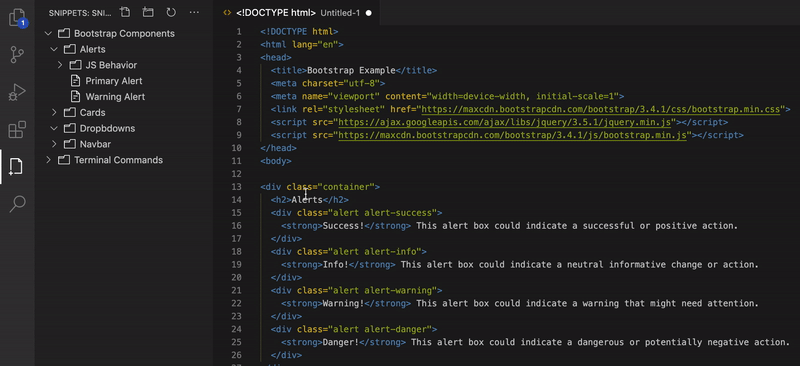
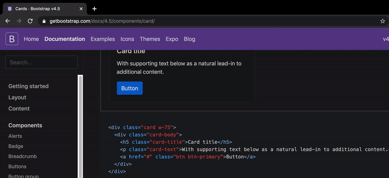
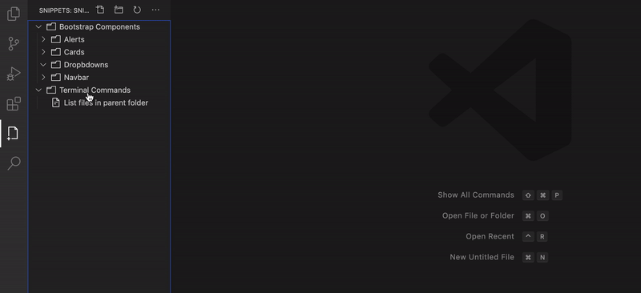
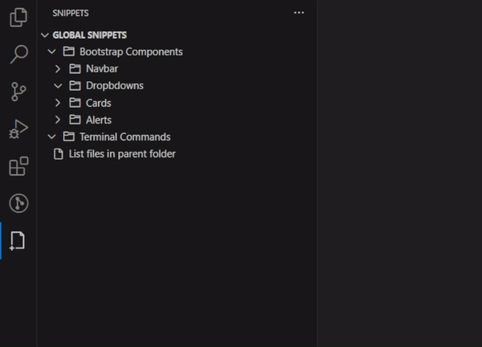
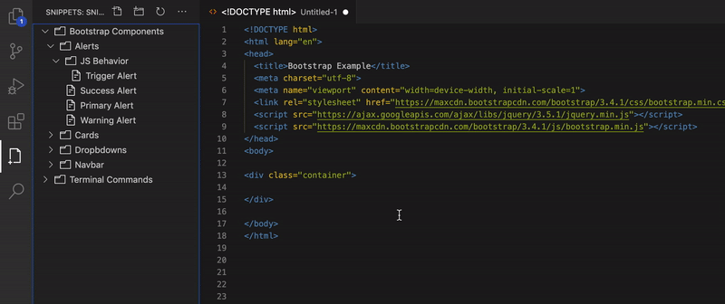
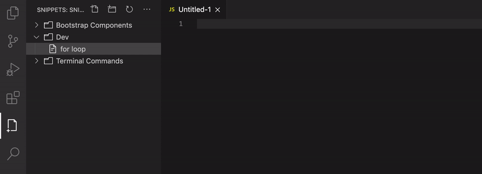
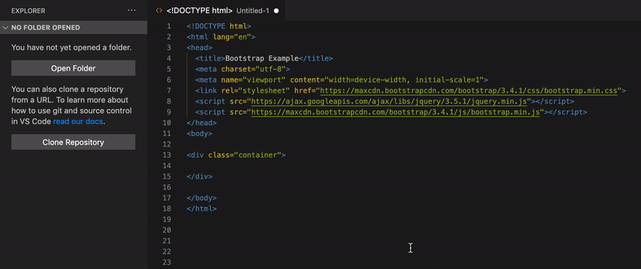
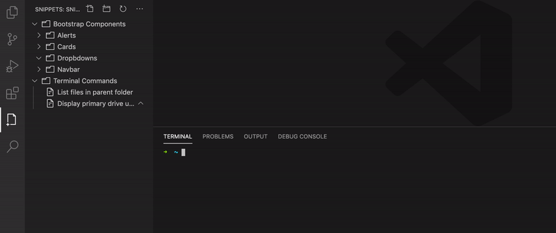
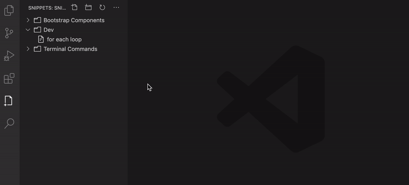

# Snippets for VSCode <!-- omit in toc -->

Code snippets are great additions to anyone who wants to save time while developing. They make it easier to enter repeating code, such as loops, complex HTML structures or reusable methods.

Visual Studio Code already has great support for snippets, including snippets appearance in IntelliSense `(Ctrl+Space)`, tab-completion, as well as a dedicated snippet picker `(Insert Snippet in the Command Palette)`.

This extension takes snippets to another level bringing new features which will improve managing code snippets.

#### Table of contents  <!-- omit in toc -->
- [Features](#features)
  - [Create a Snippet](#create-a-snippet)
  - [Organize Snippets](#organize-snippets)
  - [Open a Snippet](#open-a-snippet)
  - [Edit a Snippet](#edit-a-snippet)
- [Extension Settings](#extension-settings)
- [Installation](#installation)
- [Release Notes](#release-notes)
- [Extension Settings](#extension-settings)
- [Feedback](#feedback)
- [Credits](#credits)

## Features

### Create a Snippet

You can easily create a snippet from your open editor in VSCode.

You can add code snippet directly from outside VSCode via your clipboard.

If you have a command in mind, add it manually.

### Organize Snippets

You have the flexibility to reorder your snippets, there is no default order.

### Open a Snippet

Add your snippet with a single click.

Your snippet has variables ? No worries.

Lots of snippets ? Use Command Palette to quickly search for the wanted one.

You have some commands for terminal ? Open them directly.

### Edit a Snippet

Edit your snippet easily.

**Enjoy!**

## Extension Settings

Include if your extension adds any VS Code settings through the `contributes.configuration` extension point.

For example:

This extension contributes the following settings:

* `myExtension.enable`: enable/disable this extension
* `myExtension.thing`: set to `blah` to do something

## Installation

Open VSCode and type ctrl+P, type `ext install tahabasri.snippets`.

Calling out known issues can help limit users opening duplicate issues against your extension.

## Release Notes

Users appreciate release notes as you update your extension.

### 1.0.0

Initial release of ...

### 1.0.1

Fixed issue #.

### 1.1.0

Added features X, Y, and Z.

## Feedback

* [Request a feature](https://github.com/tahabasri/snippets/issues/new?labels=enhancement).
* [File a bug](https://github.com/tahabasri/snippets/issues/new?labels=bug).

### Credits

Icons made by <a href="https://www.flaticon.com/authors/darius-dan" title="Darius Dan">Darius Dan</a> from <a href="https://www.flaticon.com/" title="Flaticon">www.flaticon.com</a>
